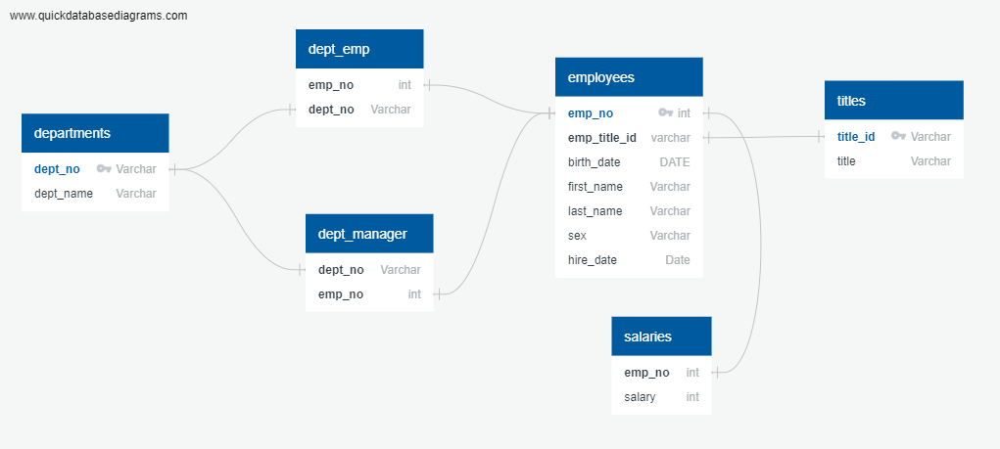

# Sql-Challenge

## Background
It’s been two weeks since you were hired as a new data engineer at Pewlett Hackard (a fictional company). Your first major task is to do a research project about people whom the company employed during the 1980s and 1990s. All that remains of the employee database from that period are six CSV files. For this project, you’ll design the tables to hold the data from the CSV files, import the CSV files into a SQL database, and then answer questions about the data. That is, you’ll perform data modeling, data engineering, and data analysis, respectively.

## 1. Data Modeling
For the Data modeling part, the employee data was organized using a method called Entity-Relationship Diagrams (ERD). This helped identify the relation between six main groups of data: employees, departments, salaries, job titles, department managers, and department employees. Each group had specific pieces of information connected to it. The ER diagram also gave insight on primary keys and foreign keys which are crucial concepts in relational databases that define relationships between different tables or entities.
The ER diagram also looks as follows:

## 2. Date Engineering 
Using the information provided, a table schema (structure for the data) for each of the six CSV files was designed, including details like data types, primary keys, foreign keys, and constraints. The sequence of these tables follows the arrangement of primary and foreign keys.
NOTE: To smoothly import each CSV file into its corresponding SQL table, it is essential to strictly follow the specified order. This will help prevent any errors during the importing process.

## 3. Data Analysis
After completing the imports successfully, a Postgresql analysis was performed, and query was written to answer these questions. List the employee number, last name, first name, sex, and salary of each employee.

List the first name, last name, and hire date for the employees who were hired in 1986.

List the manager of each department along with their department number, department name, employee number, last name, and first name.

List the department number for each employee along with that employee’s employee number, last name, first name, and department name.

List first name, last name, and sex of each employee whose first name is Hercules and whose last name begins with the letter B.

List each employee in the Sales department, including their employee number, last name, and first name.

List each employee in the Sales and Development departments, including their employee number, last name, first name, and department name.

List the frequency counts, in descending order, of all the employee last names (that is, how many employees share each last name).

you can find the full query in this file [data_analysis.sql](employeeSQL/data_analysis.sql)  
